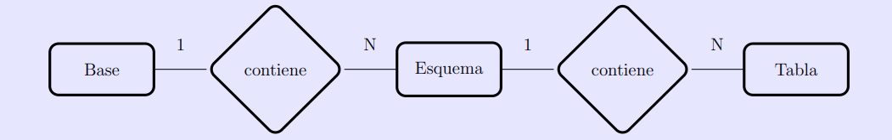

# Base de Datos 75.15/75.28/95.05 — Facultad de Ingeniería (UBA)

## Taller I: Definición de Datos en SQL

**Temas:**
- a) Introducción a docker para bases de datos
- b) Crear, documentar y guardar scripts SQL
- c) Familiarizarse con los siguientes comandos del lenguaje SQL:
  - `CREATE DATABASE` | `DROP DATABASE`
  - `CREATE TABLE` | `DROP TABLE`
  - `INSERT INTO ... VALUES` | `DELETE FROM ...`
  - `COPY`

---

## Objetivos

### 1. Instalación

Descargar e instalar Docker y docker-compose desde la página oficial.

**a)** En una terminal, verificar que estén instalados correctamente:

```bash
$ docker -v
Docker version 28.5.1, build e180ab8

$ docker compose version
Docker Compose version v2.40.2
```

**b)** Se recomienda crear una carpeta donde se generará todo lo relacionado a la base de datos.


**c)** Crear el archivo `docker-compose.yaml` con el siguiente contenido:

```yaml
services:
  # Servicio para PostgreSQL
  postgres:
    build:
      context: .
      dockerfile: Dockerfile
    image: postgres:18
    container_name: bdd_postgres_db
    environment:
      POSTGRES_DB: bdd_db
      POSTGRES_USER: admin
      POSTGRES_PASSWORD: admin123
    ports:
      - "5432:5432"
    volumes:
      - db_data:/var/lib/postgresql/data


volumes:
    db_data:
```

**d)** Estos dos archivos permiten descargar la imagen de PostgreSQL con el motor de base de datos. Iniciar el container con:

```bash
# Crear y levantar los containers
$ docker-compose up -d

# Apagar los containers
$ docker-compose down
```

**e)** Comando útil para listar todos los containers en ejecución:

```bash
$ docker ps -a
```

---

### 2. Establecimiento de una conexión

Abrir el DBeaver

Las credenciales definidas en `docker-compose.yaml`:

```yaml
environment:
  POSTGRES_DB: bdd_db
  POSTGRES_USER: admin
  POSTGRES_PASSWORD: admin123
```

Para conectarse por consola usando `psql` (entrando al container primero):

```bash
$ docker exec -it <CONTAINER_NAME> <COMMAND>
$ docker exec -it bdd_postgres_db bash

# Dentro del container:
root@123:/# psql -h <host> -p <port> -U <username> <dbName>
root@123:/# psql -h localhost -p 5432 -U admin bdd_db
psql (18.3 (Debian 18.3-1.pgdg13+1))
Type "help" for help.

bdd_db=#
```

> **Nota:** Por default siempre va a existir la base `postgres`.

---

### 3. Creación de una nueva base

Usar el comando **New Database...** para crear una nueva base de nombre `mundial`. Una vez creada, navegar por la estructura: `mundial → Schemas → Public → Tables`.

Una base en Postgres está conformada por un conjunto de esquemas (*schemas*), y un esquema está formado por un conjunto de tablas (aunque un esquema también contiene otros objetos, como funciones, vistas, tipos de dato, etc.).



La diferencia entre bases y esquemas es que una conexión a un servidor de PostgreSQL se realiza a una base específica, aunque puede trabajar con más de un esquema de dicha base. Los esquemas son una separación lógica de las tablas, mientras que tablas en bases distintas no pueden verse entre sí.

> **Nota:** Cuando se instala PostgreSQL, automáticamente se configura una base `postgres` con un esquema `public`.

---

### 4. Creación de una tabla

Abrir el editor de SQL y escribir un script con consultas `CREATE TABLE` para crear las siguientes dos tablas:

```sql
teams(team, players_used, avg_age, possession, games, goals, assists, cards_yellow, cards_red)
matches(team1, team2, goals_team1, goals_team2, stage)
```

> **Sugerencias:** Escribir las consultas SQL en varias líneas y usando tabulaciones para mayor legibilidad. Ver el Anexo para un ejemplo. Introducir comentarios con `--` para documentar el script.

Guardar el script en un archivo con extensión `.sql`. Visualizar una de las tablas creadas en el explorador de objetos y explorar las opciones del menú contextual, en particular: **New Object**, **Delete/Drop**, **Scripts** y **View Data**.

---

### 5. Eliminación de tablas

Mejorar el script anterior anteponiéndole al comando `CREATE TABLE` el comando `DROP TABLE` condicional para eliminar las tablas. Ejecutar el script.

---

### 6. Inserción manual de datos

Abrir un nuevo script con la funcionalidad **Scripts → INSERT Script** y completarlo para agregar una fila de datos a la tabla `teams`. Guardar el script, ejecutarlo y usar **View Data** para verificar los datos insertados.

> **Nota:** En SQL los strings se delimitan con comillas simples (`''`).

---

### 7. Eliminación de datos

Abrir un nuevo script con la funcionalidad **Scripts → DELETE Script** y completarlo para eliminar la fila insertada. Guardar el script, ejecutarlo y usar **View Data** para verificar que la tabla esté vacía.

---

### 8. Carga de datos desde archivos

El comando `COPY` de PostgreSQL permite cargar una tabla desde un archivo `.csv` y viceversa. Usar el comando `COPY` para cargar en cada una de las tablas los datos de los archivos provistos en el Campus: `team_data.csv` y `matches.csv`. Luego usar **View Data** para examinar las tablas.

---

### 9. SQL dump y exportación de datos

Exportar cada una de las tablas creadas a un archivo `.csv` con el comando `COPY`. Luego exportar toda la base de datos a un SQL dump usando el comando `pg_dump` de PostgreSQL y observar la estructura del archivo generado.

> **Nota:** Un SQL dump es un script con consultas SQL que permite reconstruir la base de datos desde cero. Sirve entre otras cosas como backup de la misma.

---

## Anexo

### Ejemplo de script de creación de tablas

```sql
DROP TABLE IF EXISTS mi_tabla;
CREATE TABLE mi_tabla (
    c1 VARCHAR(10) NOT NULL,
    c2 INT         NOT NULL,
    c3 NUMERIC(15,12) NOT NULL,
    c4 INT,
    c5 ...
    ...
);
```

### Uso básico del comando COPY

```sql
COPY mi_tabla
FROM 'path_archivo'
DELIMITER ';'
CSV HEADER  -- para indicar que saltee la primera línea
ENCODING 'LATIN1';
```

---

## Documentación PostgreSQL

- [DATATYPE TABLE](https://www.postgresql.org/docs/current/static/datatype.html)
- [CREATE TABLE](https://www.postgresql.org/docs/current/static/sql-createtable.html)
- [INSERT INTO](https://www.postgresql.org/docs/current/static/sql-insert.html)
- [COPY](https://www.postgresql.org/docs/current/static/sql-copy.html)

## Links Útiles

- [Docker Cheat Sheet](https://docs.docker.com/get-started/docker_cheatsheet.pdf)
- [psql Cheat Sheet](https://www.postgresqltutorial.com/postgresql-cheat-sheet/)
- [COPY import](https://www.postgresql.org/docs/current/sql-copy.html)
- [COPY export](https://www.postgresql.org/docs/current/sql-copy.html)
- [pg_dump y pg_restore](https://www.postgresql.org/docs/current/app-pgdump.html)

---

*Datos extraídos y adaptados de: [fifa-world-cup-2022-statistics](https://www.kaggle.com/datasets/swaptr/fifa-world-cup-2022-statistics) y [fifa-world-cup-2022-player-data](https://www.kaggle.com/datasets/swaptr/fifa-world-cup-2022-player-data)*
