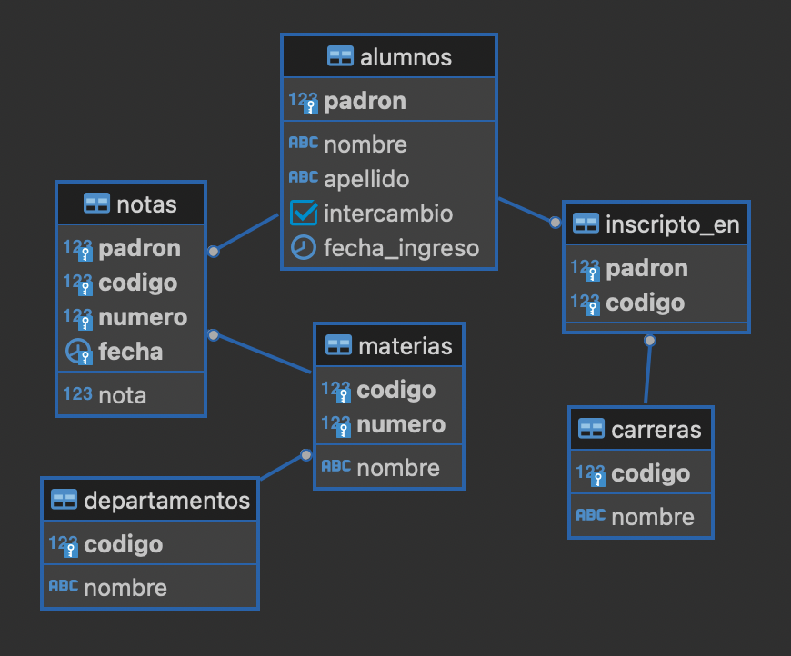

# Taller SQL

Resuelva las consultas mostradas a continuación utilizando el lenguaje SQL, para este schema:

**IMPORTANTE**: Se cuenta con un dataset que se va a utilizar en la clase, el mismo se encuentra disponible en [este repositorio](https://github.com/base-de-datos-fiuba/dbs-sql) (directorio `00-fiuba`).

## Parte A: Consultas de una tabla

0. Para familiarizarse, muestre por pantalla las cinco primeras filas de cada tabla y observe sus estructuras. ¿Cómo lo haría?

1. Devuelva todos los datos de las notas que no sean de la materia 75.1.

2. Devuelva para cada materia dos columnas: una llamada "codigo" que contenga una concatenación del código de departamento, un punto y el número de materia, con el formato "XX.YY" (ambos valores con dos dígitos, agregando ceros a la izquierda en caso de ser necesario) y otra con el nombre de la materia.

3. Para cada nota registrada, devuelva el padrón, código de departamento, número de materia, fecha y nota expresada como un valor entre 1 y 100.

4. Ídem al anterior pero mostrando los resultados paginados en páginas de 5 resultados cada una, devolviendo la segunda página.

5. Ejecute una consulta SQL que devuelva el padrón y nombre de los alumnos cuyo apellido es "Molina".

6. Obtener el padrón de los alumnos que ingresaron a la facultad en el año 2010.

## Parte B: Funciones de agregación

7. Obtener la mejor nota registrada en la materia 75.15.

8. Obtener el promedio de notas de las materias del departamento de código 75.

9. Obtener el promedio de nota de aprobación de las materias del departamento de código 75.

10. Obtener la cantidad de alumnos que tienen al menos una nota.

## Parte C: Operadores de conjunto

11. Devolver los padrones de los alumnos que no registran nota en materias.

12. Con el objetivo de traducir a otro idioma los nombres de materias y departamentos, devolver en una única consulta los nombres de todas las materias y de todos los departamentos.

## Parte D: Joins

13. Devolver para cada materia su nombre y el nombre del departamento.

14. Para cada 10 registrado, devuelva el padrón y nombre del alumno y el nombre de la materia correspondiente a dicha nota.

15. Listar para cada carrera su nombre y el padrón de los alumnos que estén anotados en ella. Incluir también las carreras sin alumnos inscriptos.

16. Listar para cada carrera su nombre y el padrón de los alumnos con padrón mayor a 75000 que estén anotados en ella. Incluir también las carreras sin alumnos inscriptos con padrón mayor a 75000.

17. Listar el padrón de aquellos alumnos que tengan más de una nota en la materia 75.15.

18. Obtenga el padrón y nombre de los alumnos que aprobaron la materia 71.14 y no aprobaron la materia 71.15.

19. Obtener, sin repeticiones, todos los pares de padrones de alumnos tales que ambos alumnos rindieron la misma materia el mismo día. Devuelva también la fecha y el código y número de la materia.

## Parte E: Agrupamiento

20. Para cada departamento, devuelva su código, nombre, la cantidad de materias que tiene y la cantidad total de notas registradas en materias del departamento. Ordene por la cantidad de materias descendente.

21. Para cada carrera devuelva su nombre y la cantidad de alumnos inscriptos. Incluya las carreras sin alumnos.

22. Para cada alumno con al menos tres notas, devuelva su padrón, nombre, promedio de notas y mejor nota registrada.

## Parte F: Consultas avanzadas

23. Obtener el código y número de la o las materias con mayor cantidad de notas registradas.

24. Obtener el padrón de los alumnos que tienen nota en todas las materias.

25. Obtener el promedio general de notas por alumno (cuantas notas tiene en promedio un alumno), considerando únicamente alumnos con al menos una nota.
